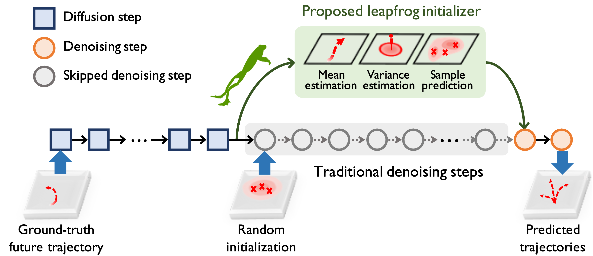

# LED

Official **PyTorch** code for CVPR'23 paper "Leapfrog Diffusion Model for Stochastic Trajectory Prediction".

## Overview

  
  

**Abstract**: To model the indeterminacy of human behaviors, stochastic trajectory prediction requires a sophisticated multi-modal distribution of future trajectories. Emerging diffusion models have revealed their tremendous representation capacities in numerous generation tasks, showing potential for stochastic trajectory prediction. However, expensive time consumption prevents diffusion models from real-time prediction, since a large number of denoising steps are required to assure sufficient representation ability. To resolve the dilemma, we present **LEapfrog Diffusion model (LED)**, a novel diffusion-based trajectory prediction model, which provides  real-time, precise, and diverse predictions. The core of the proposed LED is to leverage a trainable leapfrog initializer to directly learn an expressive multi-modal distribution of future trajectories, which skips a large number of denoising steps, significantly accelerating inference speed. Moreover, the leapfrog initializer is trained to appropriately allocate correlated samples to provide a diversity of predicted future trajectories, significantly improving prediction performances. Extensive experiments on four real-world datasets, including NBA/NFL/SDD/ETH-UCY, show that LED consistently improves performance and achieves **23.7\%/21.9\%** ADE/FDE improvement on NFL. The proposed LED also speeds up the inference **19.3/30.8/24.3/25.1** times compared to the standard diffusion model on NBA/NFL/SDD/ETH-UCY, satisfying real-time inference needs.

  
  

Here, we present an example (above) to illustrate the mean and variance estimation in the leapfrog initializer under four scenes on the NBA dataset. We see that the variance estimation can well describe the scene complexity for the current agent by the learned variance, showing the rationality of our variance estimation.

## Code Guidance

Coming soon!
